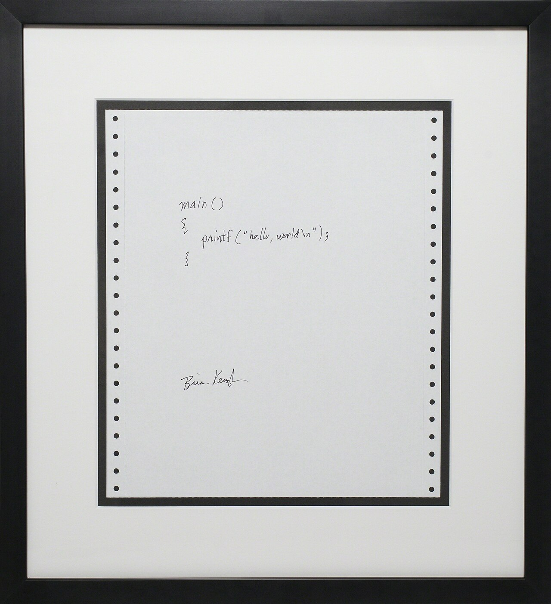

# Assets overview

## Frame [1]
 Slide
## Frame [2]
 [Source](https://pixabay.com/de/photos/anfang-gesch%C3%A4ft-menschen-studenten-849805/)
## Frame [3]
 [Source](https://pixabay.com/de/photos/bibliothek-la-trobe-lernen-1400312/)
## Frame [4]
 [Source](https://pixabay.com/de/photos/studenten-anfang-notizb%C3%BCcher-593323/)
## Frame [5]
 [Source](https://en.wikipedia.org/wiki/%22Hello,_World!%22_program#/media/File:Hello_World_Brian_Kernighan_1978.jpg)
## Frame [6]
 [Source](https://upload.wikimedia.org/wikipedia/commons/7/75/L%C3%BCbeck_-_panoramio.jpg)
## Frame [7]
 [Source](https://s3-eu-west-1.amazonaws.com/cover2.galileo-press.de/print/9783836287456_800.png)
## Frame [8]
 [Source](https://realpython.com/cdn-cgi/image/width=960,format=auto/https://files.realpython.com/media/Basic-Data-Types-in-Python_Watermarked.e3dd34457952.jpg)
## Frame [9]
 [Source](https://upload.wikimedia.org/wikipedia/commons/6/6c/Tangled_cables_on_Modular_synthesizer_-_Tokyo_Festival_of_Modular_2014_-_Day_1_%282014-06-07%29.jpg)
## Frame [10]
 [Source](https://cdn.shopify.com/s/files/1/1268/5407/files/why-is-cable-management-important.jpg?v=1602014489)